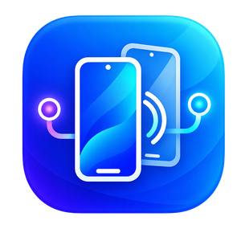

# ADB Mirror Studio

<p align="center">
  
</p>

面向 Windows 的 Android 设备连接、屏幕镜像、录屏、文件传输与环境诊断工作台。所有功能永久免费，无账户、无试用期、无订阅、无激活和功能分级。


## 下载

当前版本：`V1.0.0`

- [GitHub Release](https://github.com/Cuinings/ADB-Mirror-Studio/releases/tag/V1.0.0)
- [下载 Windows x64 自包含版](https://github.com/Cuinings/ADB-Mirror-Studio/releases/download/V1.0.0/AdbMirrorStudio-V1.0.0-win-x64.zip)

SHA256：

```text
5647A4AED29A4B3F806258D6D31538B29BFAF331D76F34CC7F030EFD5A65EFDB
```

## 主要功能

- USB、IPv4、IPv6、主机名连接
- Android 11+ mDNS 发现与六位配对码无线配对
- 流畅、均衡、高清、演示四档 scrcpy 镜像预设
- MP4/MKV 录屏和镜像会话管理
- APK 覆盖安装
- 多选、拖放、逐项状态和可取消文件传输队列
- 从设备下载文件或目录，形成双向文件传输
- 设备详情、电池与存储状态查看
- PNG 屏幕截图和 Logcat 日志导出
- USB 设备切换 ADB TCP/IP
- 设备重启与历史无线地址自动重连
- ADB、scrcpy、mDNS 和 PATH 冲突诊断
- WinUI 3、Desktop Acrylic、浅色/深色主题和 DPI 自适应
- 本地设置、首次运行说明与崩溃日志
- 通过公开 GitHub Release 免费检查更新

## 稳定性修复

- 修复多任务并发时忙碌状态提前解除、重复传输和刷新结果覆盖问题
- 刷新设备后保持文件与工具页的设备选择，不再跳回错误设备
- 修复镜像会话重复启动、停止与进程退出之间的并发竞态
- 修复关闭程序后自带 ADB/scrcpy 残留并占用解压目录的问题
- 修复初始化期间快速关闭可能产生异常退出的问题
- 设置文件损坏、锁定或无权限时安全恢复默认值
- 修复浅色模式、标题栏对齐、小窗口与高 DPI 下内容显示不全
- 修复两段式 Release 版本号、录屏扩展名大小写和截图临时文件清理
- 移除与设备中心功能重复的侧边栏“无线配对”入口，连接与配对统一在设备中心完成
- 设备详情的 Android、API、分辨率、电池和存储信息改为并行采集，降低等待时间
- scrcpy 长时间镜像日志使用固定 64 KiB 尾部缓冲，避免内存随运行时间持续增长

## 增强功能

- 自动检测设备视频编码能力，高清模式优先 H.265，其余场景优先低延迟 H.264，并自动兼容 AV1、VP8、VP9
- 镜像会话显示预设、编码器、分辨率、帧率、码率和录制状态
- 多设备镜像窗口支持宫格、横向和纵向自动排列
- 设备工具提供返回、主页、最近任务、电源和音量快捷控制
- 用户应用管理器支持读取、启动、强制停止和确认卸载
- 录制中心集中显示文件、目标设备与当前录制状态
- 修复已有镜像被复用时错误提示已录制的问题；切换录制配置会要求先停止旧会话
- 录制中心改为可滚动卡片，支持完成状态、文件大小和打开输出目录

## 免费使用策略

- 所有现有及后续内置功能均免费开放
- 不区分个人版、专业版、商业版或企业版
- 不要求注册账户或联网激活
- 不设置试用期限、设备数量付费墙或订阅校验
- 个人、组织和企业均可在合法授权的设备上免费使用
- 在线更新检查只访问公开 GitHub Release，不上传设备或用户信息

## 系统要求

- Windows 10 1809（Build 17763）或更高版本
- x64 处理器
- Android 5.0 或更高版本
- USB 调试或无线调试已启用

发布包已包含 .NET、Windows App SDK、ADB 和 scrcpy，无需另外安装 Python 或 .NET。

## 快速开始

1. 下载并完整解压 `AdbMirrorStudio-V1.0.0-win-x64.zip`。
2. 双击 `AdbMirrorStudio.App.exe`。
3. 在手机中开启“开发者选项”和“USB 调试”。
4. 首次连接时在手机端允许 USB 调试授权。
5. 在应用中刷新设备并点击“打开镜像”。

请勿直接在 ZIP 压缩包中运行程序。

## 无线配对

Android 11+：

1. 打开“开发者选项 → 无线调试”。
2. 选择“使用配对码配对设备”。
3. 在应用中输入配对地址和六位配对码。
4. 配对完成后，使用无线调试主页面显示的连接地址建立连接。

配对端口与连接端口通常不同。不要把 ADB TCP/IP 端口暴露到公网。

## 构建

需要 .NET 10 SDK 和 Windows 10/11 SDK。

运行测试：

```powershell
.\.tools\dotnet\dotnet.exe test `
  .\commercial\tests\AdbMirrorStudio.UnitTests\AdbMirrorStudio.UnitTests.csproj `
  --configuration Release
```

生成自包含发行包：

```powershell
.\commercial\scripts\build-release.ps1
```

输出目录：

```text
commercial\artifacts\release\
```

## 技术架构

- `AdbMirrorStudio.Domain`：设备、镜像和设置领域模型
- `AdbMirrorStudio.Application`：业务接口与协调逻辑
- `AdbMirrorStudio.Infrastructure`：ADB、scrcpy、进程、诊断和持久化实现
- `AdbMirrorStudio.App`：WinUI 3 页面与视图模型
- `AdbMirrorStudio.UnitTests`：命令参数、解析、设置和并发刷新测试

外部命令使用独立参数列表执行，不通过 shell 拼接；支持超时、取消和进程树清理。

## 文档

- [完整使用、开发和发布手册](commercial/README.md)
- [V1.0.0 发行说明](commercial/RELEASE-NOTES-V1.0.0.md)
- [隐私说明](commercial/PRIVACY.md)
- [免费使用许可](commercial/FREE-USE-LICENSE.md)
- [第三方组件归属](commercial/THIRD-PARTY-NOTICES.md)

## 发行状态

V1.0.0 为首个免费公开版本。代码签名、安装程序和完整第三方许可归档仍属于发行工程改进，不会用于限制功能或建立付费版本。

本项目仅应用于用户拥有或已获明确授权的 Android 设备。不得用于未经授权的访问、监控或数据复制。
